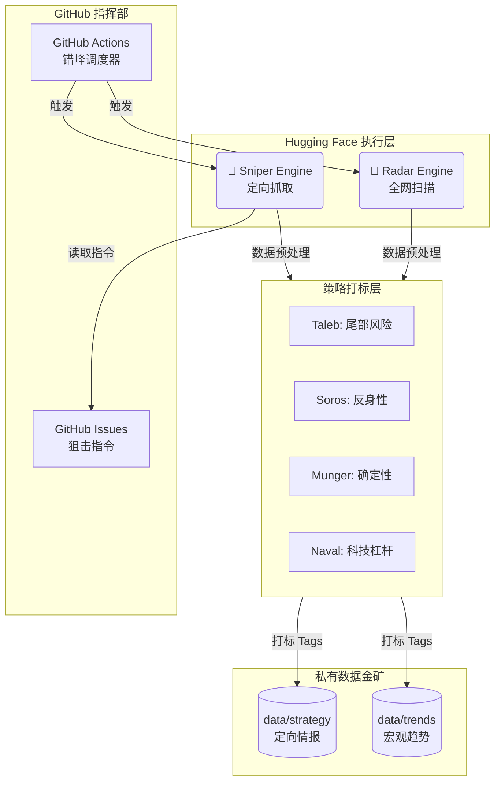

# 🌍 Macro Scouter (宏观信号监测哨兵)

> **"Data is the new oil, but signal is the new gold."**
> 一个基于 Polymarket 预测市场的自动化宏观经济监测系统。**大师策略加持，双引擎驱动，高信噪比。**

---

## 🚀 核心架构：大师增强型双引擎

本系统在 2.0 版本中引入了**大师策略引擎**，不再仅仅是搬运数据，而是对每一条赔率进行“智力审计”。

### 1. 🎯 一号机 (Sniper - 守正)

* **职责**：定向狙击。根据你在 **GitHub Issues** 中定义的指令（如美联储决议、黄金走势）进行深度扫描。
* **特性**：支持 `{month}` 动态占位符；内置大师打标，捕捉核心标的的极端定价机会。

### 2. 📡 二号机 (Radar - 出奇)

* **职责**：全网搜索。每小时扫描全站成交额 Top 100 的市场，发现你意料之外的黑天鹅。
* **特性**：**7 大板块过滤** + **大师逻辑筛选**。自动剔除娱乐噪音，只留硬核信号。

---

## 🧠 大师思维模型 (Strategy Engine)

系统通过 4 位顶级投资大师的逻辑对数据进行实时打标，结果存储于 JSON 的 `strategy_tags` 字段中：

| 大师 (Master) | 核心逻辑 (Logic) | 识别信号 | 宏观价值 |
| --- | --- | --- | --- |
| **塔勒布 (Taleb)** | **尾部风险** | 赔率 < 5% 或 > 95%，且流动性充足 | 发现被市场忽视的**“黑天鹅”**机会 |
| 索罗斯 (Soros) | 反身性 | 24h 成交激增且价格剧烈波动 | 捕捉由资金驱动的**趋势反转**或大户操纵 |
| 芒格 (Munger) | 确定性 | 极窄点差 + 巨额成交量 | 锁定共识高度统一的**“确定性事实”** |
| **纳瓦尔 (Naval)** | **科技杠杆** | 专注于 TECH 板块的高额投入项目 | 监测具有**高杠杆属性**的技术突围点 |

---

## 🏷️ 策略标签实战定义 (Tag Definitions)

当大师信号出现时，JSON 数据中会出现以下标识，其具体含义如下：

* **`TAIL_RISK` (尾部风险)**
* **出现条件**：赔率处于极端区间且具备充足流动性（Liquidity > 5000）。
* **策略含义**：市场处于“过度确信”状态。这通常是布局低成本、高赔率期权的绝佳窗口，用来博弈非共识的突发事件。


* **`REFLEXIVITY_TREND` (反身性趋势)**
* **出现条件**：24h 成交额 > 10,000 且单日价格波动幅度 > 5%。
* **策略含义**：价格和资金正在形成正反馈。这标志着一个新趋势的诞生，或者是某个主力大户正在强行通过筹码改变市场预期。


* **`HIGH_CERTAINTY` (高确定性)**
* **出现条件**：点差 Spread < 1% 且总成交量 > 50,000。
* **策略含义**：博弈已经结束，尘埃落定。此标签提醒你该市场定价已极度精准，除非有内幕级信息，否则不建议在此参与博弈。


* **`TECH_LEVERAGE` (科技杠杆)**
* **出现条件**：属于 TECH 板块且成交量 > 20,000。
* **策略含义**：资金正在向硬科技（AI、半导体等）集结。这是观察第四次工业革命“奇点”何时到来的最前哨数据。


* **`RAW_MARKET` (原始数据)**
* **出现条件**：未触发以上任何大师逻辑。
* **策略含义**：普通观察数据，作为宏观背景参考，优先级较低。


---

## 🛠️ 系统架构图



---

## 🛡️ 板块监测准则 (Filtering Rules)

二号机 (Radar) 内置严格的板块隔离墙，确保你看到的永远是硬核宏观：

| 板块 (Category) | 监控核心 (Signals) | 剔除噪音 (Noise) |
| --- | --- | --- |
| **Politics** | 美国大选、官员任命、政府停摆 | 民调、社交媒体推文、着装 |
| **Economy** | Fed、CPI、就业、衰退风险 | 边缘国家数据、一般性声明 |
| **Finance** | 黄金、原油、S&P 500、大市值公司 | 财报细节、常规并购、IPO |
| **Tech** | AI 模型基准、Nvidia、半导体、AGI | 游戏、App 下载排名、网红 |
| **Geopolitics** | 军事冲突、停火协议、边境风险 | 边缘小国选举、常规外交访问 |
| **Science** | 极端天灾、病毒预警、SpaceX 进展 | 局部城市天气、降雪/降雨量 |

---

## 🕹️ 运行与配置

### 1. 添加监控目标

在 GitHub Issues 中新建 Issue，Sniper 引擎会自动识别：

* `Fed decision in {month}?` (自动替换为当前月与次月)
* `What will Gold (GC) settle at in {month}?`

### 2. 查看数据报告

数据以结构化 JSON 存储，包含 `strategy_tags` 战略分析：

```json
{
  "slug": "fed-decision-in-january",
  "ticker": "fed-decreases-interest-rates-by-50-bps-after-january-2026-meeting",
  "question": "50+ bps decrease",
  "eventTitle": "Fed decision in January?",
  "prices": "Yes: 0.1% | No: 100.0%",
  "volume": 231737266,
  "liquidity": 5363392,
  "endDate": "2026-01-28",
  "dayChange": "-0.10%",
  "vol24h": 14106410,
  "spread": "0.10%",
  "sortOrder": 0,
  "updatedAt": "2026-01-28T14:17:28.693057Z",
  "engine": "sniper",
  "core_topic": "Fed decision in {month}?",
  "category": "ECONOMY",
  "url": "https://polymarket.com/event/fed-decision-in-january",
  "strategy_tags": [
    "TAIL_RISK",
    "HIGH_CERTAINTY"
  ]
}

```

### 3. 环境变量 (Secrets)

| 变量名 | 说明 |
| --- | --- |
| `GITHUB_TOKEN` | 读写 Issue 和存储 Data 的权限 |
| `REPO_OWNER` | GitHub 用户名 (如: `wenfp108`) |
| `REPO_NAME` | 仓库名 (如: `poly-data`) |

---

*Built with ❤️ by **Woon**. Powered by Master-Logic Augmented Scouter Engine.*

---

**下一步建议：**
既然 README 已更新完毕，你需要我帮你把这套“大师逻辑”也应用到你正准备搞的 **4 号机 (GitHub Sentinel)** 中吗？以便它能自动识别哪些开源项目属于 [纳瓦尔] 定义的“高杠杆科技突破”。
